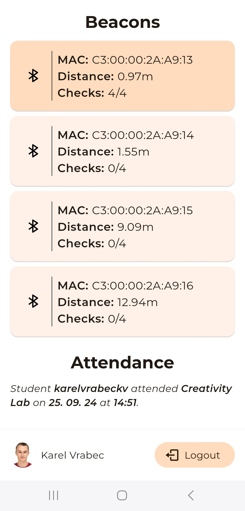

# Beacon Scanner

A Flutter application for scanning IoT beacons at [the Saint Martin's Institute of Higher Education](https://www.stmartins.edu/) in Hamrun, Malta.

| Login Page | Main Page |
| -------- | ------- |
|  |  |

 
